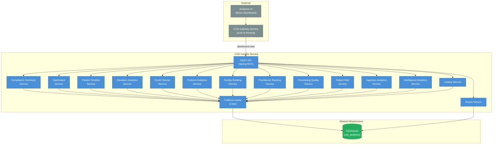

# Architecture & Design

## 1. System Context

The **CCE Insights Service** (referred to as "Analytics Service" in the Solution Design v0.3) serves compliance analytics data — protocol adherence rates, deviation trends, facility-level summaries, patient compliance timelines, ingestion pipeline metrics, and source system quality analysis. It is a **read-only** service that queries the Compliance DB and Collector DB directly and exposes REST APIs consumed by the Analytics UI dashboard.

> All inbound requests arrive via the **CCE Gateway Service**, which validates OAuth tokens and enforces the `dashboard:read` scope. The Insights Service does not handle authentication or authorization.



**This service does NOT handle:** event ingestion, protocol matching, step completion, deviation detection, time-based transitions, authentication/authorization, or any write operations.

> **Event Volume Analytics:** In addition to compliance-focused analytics, the Insights Service provides event volume metrics — counts of clinical events grouped by FHIR `resourceType`, facility, practitioner, and source system. These metrics are derived from the `event_log` table (immutable log of all inbound CloudEvents maintained by the Matcher Service; `matcher_event_logs` in ClickHouse, `compliance_event_logs` before 2.0.0). Practitioner information is extracted from the `event_log.data` JSONB column using resource-type-specific paths.

> **Ingestion Analytics:** The Insights Service also queries the `inbound_event` table (owned by the Collector Service) to provide ingestion pipeline metrics — acceptance/rejection funnels, rejection reason analysis, source data quality scores, and pipeline loss tracking. Source-level event counts are also powered by `inbound_event` to capture ALL received events, not just compliance-matched ones.

---

## 2. Technology Stack

| Concern | Technology | Version |
|---------|------------|---------|
| Language | Java | 21 (LTS) |
| Framework | Spring Boot | 3.4.x |
| Build tool | Gradle | 8.x |
| Database | ClickHouse | (deployed via deploy-scripts) |
| DB access | jOOQ | 3.19.x (type-safe SQL, no ORM) |
| DB driver | ClickHouse JDBC | 0.8.3 |
| Observability | Micrometer + Prometheus | (Spring Boot managed) |
| Logging | Logstash Logback Encoder | 7.4 |
| Testing | JUnit 5, MockMvc (`@WebMvcTest`) | |

### Key Gradle Dependencies

```groovy
// Spring Boot starters
implementation 'org.springframework.boot:spring-boot-starter-web'
implementation 'org.springframework.boot:spring-boot-starter-jdbc'
implementation 'org.springframework.boot:spring-boot-starter-jooq'
implementation 'org.springframework.boot:spring-boot-starter-actuator'

// ClickHouse JDBC driver
implementation 'com.clickhouse:clickhouse-jdbc:0.8.3'
runtimeOnly 'org.apache.httpcomponents.client5:httpclient5'

// Caching
implementation 'org.springframework.boot:spring-boot-starter-cache'
implementation 'com.github.ben-manes.caffeine:caffeine'

// Observability
implementation 'io.micrometer:micrometer-registry-prometheus'
implementation 'net.logstash.logback:logstash-logback-encoder:7.4'

// jOOQ code generator (build-time only)
jooqGenerator 'com.clickhouse:clickhouse-jdbc:0.8.3'
jooqGenerator 'org.apache.httpcomponents.client5:httpclient5'
jooqGenerator 'org.slf4j:slf4j-simple:2.0.13'
```

**Not included:** Spring Data JPA, Hibernate, Flyway (ClickHouse schema is managed by deploy-scripts), Spring Kafka, Testcontainers (unit tests use `@WebMvcTest` mocks).

---

## 3. Package Structure

```
src/
├── generated/jooq/org/openphc/cce/insights/jooq/   # Auto-generated — do not edit manually
│   ├── Tables.java          # Static field: Tables.STEP_INSTANCES, Tables.DEVIATIONS, etc.
│   ├── Keys.java            # Primary key definitions
│   ├── CceAnalytics.java    # Schema descriptor
│   └── tables/              # One class per table/materialized view (67 total)
│
└── main/java/org/openphc/cce/insights/
    ├── InsightsServiceApplication.java
    ├── config/
    │   ├── CacheConfig.java             # Caffeine 3-tier cache (lookups/analytics/metrics)
    │   ├── JooqConfig.java              # DSLContext with ClickHouse render settings
    │   ├── MetricsConfig.java
    │   └── ObservabilityConfig.java
    ├── domain/repository/               # jOOQ-based repositories (no JPA entities)
    │   ├── ProtocolDefinitionRepositoryImpl.java
    │   ├── ProtocolInstanceRepositoryImpl.java
    │   ├── StepInstanceRepositoryImpl.java
    │   ├── DeviationRepositoryImpl.java
    │   ├── ComplianceEventLogRepositoryImpl.java
    │   ├── InboundEventLogRepositoryImpl.java
    │   ├── IntelligenceDeliveryRepositoryImpl.java
    │   ├── ReceiverAdaptorRepositoryImpl.java
    │   ├── DestinationAdaptorMappingRepositoryImpl.java
    │   └── DailyKpiRepositoryImpl.java  # raw DSL queries against schema/07 MVs + facility
    ├── health/
    │   └── DatabaseHealthIndicator.java
    ├── service/                         # Business logic / aggregation
    └── web/                             # Controllers + DTOs

src/main/resources/
├── application.yml
└── logback-spring.xml

src/test/                                # @WebMvcTest unit tests (no DB needed)
src/integrationTest/                     # Integration tests
```

---

## 4. Data Access Patterns

### 4.1 Read-Only Design

All queries are read-only. The Insights Service never performs `INSERT`, `UPDATE`, or `DELETE`. ClickHouse is an append-only analytics engine — mutations are rare and handled exclusively by the data pipeline, never by this service.

jOOQ generates type-safe Java field references from the live ClickHouse schema. The generated classes live in `src/generated/jooq/` and are committed to the repo. Repositories use `DSLContext` directly — no ORM, no entity manager, no `@Transactional`.

```java
// Example: type-safe field reference instead of raw string
dsl.select(DSL.field(STEP_INSTANCES.STATE.getName()))
   .from(DSL.table(DSL.sql("step_instances")))
   .where(DSL.field(STEP_INSTANCES.PATIENT_ID.getName()).eq(patientId))
   .fetch();
```

### 4.2 Tables Queried

| Table | Type | Queries Used For |
|---|---|---|
| `protocol_definitions` | ReplacingMergeTree | Protocol metadata (name, version, URL) |
| `protocol_instances` | ReplacingMergeTree | Patient enrollments, compliance rates, filtering |
| `step_instances` | ReplacingMergeTree | Step `step_status` (Matcher) × `sla_status` (Step SLA), timing, completion, facility joins via `mv_patient_facility_latest` |
| `step_sla_state_transitions` | ReplacingMergeTree | Per-step SLA thresholds (`process_by`) — clinical occurrence date of OVERDUE / MISSED deviations, `overdueDate` / `missedDate` in protocol tracking (new in 2.0.0) |
| `deviations` | ReplacingMergeTree | Deviation records, trends, counts by type (enrollment reached through `step_instances` since 2.0.0) |
| `matcher_event_logs` | ReplacingMergeTree | Patient event history, timeline, event volume analytics (1.x `compliance_event_logs`) |
| `inbound_event_logs` | MergeTree | Ingestion funnel, rejection analytics, source quality, pipeline loss |
| `intelligence_deliveries` | ReplacingMergeTree | Intelligence delivery tracking, action type stats, delivery status |
| `receiver_adaptor` | ReplacingMergeTree | Adaptor registry lookups |
| `destination_adaptor_mapping` | ReplacingMergeTree | Destination routing configuration |
| `mv_patient_facility_latest` | AggregatingMV | Latest facility per patient (used in step_instances joins) |
| `mv_practitioner_summary` | AggregatingMV | Pre-aggregated practitioner analytics |
| `mv_facility_summary` | AggregatingMV | Pre-aggregated facility summaries |
| `facility` | ReplacingMergeTree | Static in-scope facility list + expected daily patient throughput (schema/08) — denominator for facility activity and adoption metrics |
| `mv_daily_compliance_kpis` | ReplacingMergeTree | Daily compliance KPI snapshots per protocol (schema/07, APPEND-mode refresh) |
| `mv_daily_adoption_kpis` | ReplacingMergeTree | Daily e-Buzima adoption per facility: actual vs expected patients (schema/07, `event_time` day) |
| `mv_daily_deviation_kpis` | ReplacingMergeTree | Daily deviation header cards per protocol (schema/07, clinical occurrence date) |
| `mv_daily_event_kpis` | ReplacingMergeTree | Daily event pipeline summary: totals, rates, pipeline loss (schema/07, `event_time` day) |
| `mv_daily_referral_kpis` | ReplacingMergeTree | Daily referral KPIs (`event_time` day × facility; `referral_count` = received by HIE, `matched_count` = compliant) — backs the Referrals dashboard KPI (schema/07) |
| `mv_event_volume_hourly` | AggregatingMV | Hourly ACCEPTED event volume keyed by `event_time` — backs the active-facility tiles and Events page cards |

> **Removed (schema/07):** `mv_daily_facility_kpis` and `mv_daily_facility_activity_summary` were dropped. The Facilities ranking is now computed live from the enrolled-patient cohort joined to `inbound_event_logs`, and the active-facility tiles read `mv_event_volume_hourly` (event_time-keyed).

> **FINAL clause:** ClickHouse `ReplacingMergeTree` tables may have duplicate rows until background merges complete. The `FINAL` modifier forces deduplication at query time. All queries against `mv_daily_*` tables and `facility` must use `FINAL` — these are always queried with explicit `FINAL` in `DailyKpiRepositoryImpl`.

> **2.0.0 schema (derived columns):** `protocol_instances.protocol_canonical` and
> `deviations.protocol_instance_id` were dropped upstream. `AbstractClickHouseRepository` rebuilds
> them as derived tables — `protocolInstancesWithCanonical(alias)` (`ANY LEFT JOIN protocol_definitions`,
> `url|version`) and `deviationsWithInstance(alias)` (`ANY LEFT JOIN step_instances`) — so queries keep
> reading `pi.protocol_canonical` / `d.protocol_instance_id`. `slaThresholds()` exposes each step's
> `DUE_DATE_REACHED` / `MISSED_DATE_REACHED` `process_by` (alias `sla`) for the deviation occurrence date.
> The `dict_protocol_definitions` dictionary is deliberately not used: its ClickHouse source authenticates
> on its own, and a join on the tiny definitions table has no such dependency.

> **Soft-delete awareness (`_is_deleted = 0`):** The `protocol_instances` table uses `ReplacingMergeTree(_version, _is_deleted)`. Debezium CDC propagates Postgres deletes as new rows with `_is_deleted=1` rather than physical deletions. Until ClickHouse background merges run (which can be delayed on low-traffic UAT environments), both the original row and the tombstone row co-exist. All `ProtocolInstanceRepositoryImpl` queries include an explicit `_is_deleted = 0` filter as the first `WHERE` condition so deleted protocol instances never appear in compliance analytics regardless of whether `FINAL` has merged the data. The `CLICKHOUSE_USE_FINAL` flag (default `false` on UAT) provides an additional safeguard but is not relied upon as the primary guard.

> **Chunked `IN (...)` clauses (`max_query_size`):** jOOQ's `.in(List<...>)` binds one
> parameter per element. Building `protocol_instance_id IN (...)` from an unbounded id
> list (e.g. every enrolled patient across a wide date range) can produce thousands of
> bind params, blowing past ClickHouse's `max_query_size` (default 262144 bytes) and
> surfacing as a generic `transport error: 400` / 503 to the caller. `AbstractClickHouseRepository.chunkIds(List)`
> splits any id list into batches of ≤1000 before building an `IN` clause; callers issue
> one query per chunk and concatenate results (safe here because each id lands in
> exactly one chunk, so `groupBy`-per-id aggregations never need re-merging across
> chunks). Used by `StepInstanceRepositoryImpl.findByProtocolInstanceIdIn` and the three
> id-scoped lookups in `DeviationRepositoryImpl`. Any new query built from an
> externally-sized id list should go through this helper rather than calling `.in(...)`
> directly.

### 4.3 Key Query Patterns

> **⚠ Stale — PostgreSQL-era pseudocode.** The SQL below (and in §9/§10) predates the
> ClickHouse migration: it uses PostgreSQL-only syntax (`EXTRACT(EPOCH FROM ...)`,
> `PERCENTILE_CONT(...) WITHIN GROUP`, `FILTER (WHERE ...)`, `->>'...'` JSONB access,
> `::float` casts) and singular table names (`protocol_instance`, `step_instance`,
> `event_log`) that no longer exist — the real ClickHouse tables are plural
> (`protocol_instances`, `step_instances`, `matcher_event_logs`, ...) and queried via
> jOOQ, not raw SQL. It's kept here to show the original *intent* of each metric: for the
> actual, current query for any given metric, read the corresponding method in
> `src/main/java/org/openphc/cce/insights/domain/repository/*RepositoryImpl.java` — those
> use ClickHouse idioms like `finalAs(...)`/`FINAL`, `toUUID(?)`,
> `parseDateTime64BestEffort(?)`, and `medianIf(...)`/`avgIf(...)`/`countIf(...)` instead
> of the constructs below. See the "FINAL clause", "Soft-delete awareness", and "Chunked
> `IN (...)`" callouts above for the patterns that **do** reflect current behavior.

**Protocol Compliance Summary:**
```sql
SELECT
  pd.url || '|' || pd.version AS protocol_canonical,
  COUNT(DISTINCT pi.id) AS total_enrollments,
  COUNT(DISTINCT CASE WHEN pi.status = 'COMPLETED' THEN pi.id END) AS completed,
  COUNT(DISTINCT CASE WHEN pi.status = 'ACTIVE' THEN pi.id END) AS active,
  AVG(
    CASE WHEN pi.status IN ('ACTIVE', 'COMPLETED') THEN
      (SELECT COUNT(*) FROM step_instance si WHERE si.protocol_instance_id = pi.id AND si.step_status = 'COMPLETED')::float /
      NULLIF((SELECT COUNT(*) FROM step_instance si WHERE si.protocol_instance_id = pi.id), 0)
    END
  ) AS avg_compliance_rate
FROM protocol_instance pi
JOIN protocol_definition pd ON pi.protocol_definition_id = pd.id
WHERE pd.id = :protocolDefinitionId
GROUP BY pd.url, pd.version;
```

**Facility Compliance Summary:**
```sql
SELECT
  el.facility_id,
  COUNT(DISTINCT pi.id) AS total_enrollments,
  COUNT(DISTINCT CASE WHEN si.sla_status IN ('OVERDUE', 'MISSED') THEN pi.id END) AS with_deviations
FROM protocol_instance pi
JOIN step_instance si ON si.protocol_instance_id = pi.id
JOIN event_log el ON el.protocol_instance_id = pi.id
WHERE el.facility_id = :facilityId
  AND el.facility_id IS NOT NULL
GROUP BY el.facility_id;
```

**Event Volume by Resource Type:**
```sql
SELECT
  el.data->>'resourceType' AS resource_type,
  COUNT(*) AS event_count
FROM event_log el
WHERE el.processing_status != 'DUPLICATE'
  AND (:facilityId IS NULL OR el.facility_id = :facilityId)
  AND (:startDate IS NULL OR el.event_time >= :startDate)
  AND (:endDate IS NULL OR el.event_time <= :endDate)
GROUP BY el.data->>'resourceType'
ORDER BY event_count DESC;
```

**Event Volume by Facility:**
```sql
SELECT
  el.facility_id,
  el.data->>'resourceType' AS resource_type,
  COUNT(*) AS event_count
FROM event_log el
WHERE el.facility_id IS NOT NULL
  AND el.processing_status != 'DUPLICATE'
  AND (:startDate IS NULL OR el.event_time >= :startDate)
  AND (:endDate IS NULL OR el.event_time <= :endDate)
GROUP BY el.facility_id, el.data->>'resourceType'
ORDER BY el.facility_id, event_count DESC;
```

**Event Volume by Practitioner:**

Practitioner references are extracted from different JSONB paths depending on the FHIR resource type:

| Resource Type | JSONB Path | Example Value |
|---|---|---|
| Encounter | `data->'participant'->0->'individual'->'reference'` | `Practitioner/HLC-PRAC-2025-00005` |
| Observation | `data->'performer'->0->'reference'` | `Practitioner/HLC-PRAC-2025-00005` |
| Condition | `data->'asserter'->'reference'` | `Practitioner/f830114a-...` |
| MedicationRequest | `data->'requester'->'reference'` | `Practitioner/f830114a-...` |
| MedicationDispense | `data->'performer'->0->'actor'->'reference'` | `Practitioner/...` |
| MedicationAdministration | `data->'performer'->0->'actor'->'reference'` | `Practitioner/...` |
| ServiceRequest | `data->'requester'->'reference'` | `Practitioner/...` |
| Procedure | `data->'performer'->0->'actor'->'reference'` | `Practitioner/...` |
| Immunization | `data->'performer'->0->'actor'->'reference'` | `Practitioner/...` |

```sql
SELECT
  COALESCE(
    el.data->'participant'->0->'individual'->>'reference',
    el.data->'performer'->0->>'reference',
    el.data->'asserter'->>'reference',
    el.data->'requester'->>'reference',
    el.data->'performer'->0->'actor'->>'reference'
  ) AS practitioner_ref,
  el.data->>'resourceType' AS resource_type,
  COUNT(*) AS event_count
FROM event_log el
WHERE el.processing_status != 'DUPLICATE'
  AND (:facilityId IS NULL OR el.facility_id = :facilityId)
  AND (:startDate IS NULL OR el.event_time >= :startDate)
  AND (:endDate IS NULL OR el.event_time <= :endDate)
GROUP BY practitioner_ref, resource_type
HAVING practitioner_ref IS NOT NULL
ORDER BY event_count DESC;
```

**Event Volume by Source System:**
```sql
SELECT
  el.source,
  el.data->>'resourceType' AS resource_type,
  COUNT(*) AS event_count
FROM event_log el
WHERE el.processing_status != 'DUPLICATE'
  AND (:startDate IS NULL OR el.event_time >= :startDate)
  AND (:endDate IS NULL OR el.event_time <= :endDate)
GROUP BY el.source, el.data->>'resourceType'
ORDER BY el.source, event_count DESC;
```

**Deviation Trends:**
```sql
SELECT
  DATE_TRUNC(:interval, d.detected_at) AS period,
  d.deviation_type,
  COUNT(*) AS count
FROM deviation d
WHERE d.detected_at BETWEEN :startDate AND :endDate
GROUP BY period, d.deviation_type
ORDER BY period;
```

---

## 5. Caching

The Insights Service uses **Caffeine** for in-memory response caching, organized into three tiers with configurable TTLs:

| Cache Name | Default TTL | Max Entries | Purpose |
|---|---|---|---|
| `lookups` | 60 minutes | 50 | Dropdown filter data (protocols, facilities, practitioners, sources, patients) |
| `analytics` | 30 minutes | 200 | Compliance summaries, protocol analytics, deviation analytics, patient risk |
| `metrics` | 15 minutes | 500 | Event volume, ingestion pipeline, processing quality |

**Configuration:** TTLs are configurable via environment variables `CACHE_TTL_LOOKUPS`, `CACHE_TTL_ANALYTICS`, `CACHE_TTL_METRICS` (in minutes).

**Cache annotations:** `@Cacheable` is applied to 25 service methods across 9 service classes. Cache keys are derived from method parameters (date ranges, filters, IDs).

### Data Source

The Insights Service queries **ClickHouse** (`cce_analytics`) — the dedicated analytics DB populated
by the CDC data pipeline (cce-data-pipeline repo). Most analytical endpoints read from pre-aggregated
materialized views (schema/03, schema/06, schema/07) rather than scanning base tables.

| Query type | Source | Notes |
|---|---|---|
| Compliance / facility / deviation header cards | `mv_daily_*` (schema/07) | 30-second refresh, snapshot_date filter |
| Protocol timelines, drill-downs | base tables + schema/06 rollups | Live, FINAL |
| Facility adoption | `mv_daily_adoption_kpis` | Requires `facility` seeded |
| Facility activity tiles | `mv_event_volume_hourly` (event_time) | Active-facility count intersected with facility reference list |
| Referrals KPI | `mv_daily_referral_kpis` (event_time) | Received by HIE + compliant/non-compliant split + rate, with per-facility (and district) breakdown |
| Event volume, ingestion, trends | `mv_event_volume_hourly`, `matcher_event_logs`, `inbound_event_logs` | Live or hourly MVs |

### Metric time semantics

**Metric time semantics** — two clocks, chosen by metric type:

- **Functional metrics** — clinical/business KPIs (adoption, compliance, deviations, event volume, referrals, patient cohorts). Measured on **clinical `event_time`**: when the clinical act actually happened, as carried on the inbound event. Every page's date filter scopes these by `event_time`, so ingestion lag (offline sync, batch upload, retries, DLQ replay) never shifts the numbers.
- **Technical / operational metrics** — the Ingestion page (pipeline health / ingestion throughput). Measured on **processing / system time** (`received_at`).

Rule of thumb: "when did it happen clinically?" → `event_time`; "when did our system handle it?" → `received_at`. Every page is clinical EXCEPT Ingestion, which is the sole system-time view.

> **Compliance / Patients cohorts** date-filter on `enrolled_at`, which the matcher service sets to clinical time (so it is functional/clinical going forward; pre-existing rows remain processing-time until a re-snapshot/replay).

---

## 6. Error Handling

| Scenario | Response | HTTP Status |
|---|---|---|
| Resource not found | `{ "error": { "code": "NOT_FOUND", "message": "..." } }` | 404 |
| Invalid query parameters | `{ "error": { "code": "VALIDATION_ERROR", "message": "..." } }` | 400 |
| Database unreachable | `{ "error": { "code": "SERVICE_UNAVAILABLE", "message": "..." } }` | 503 |
| Unexpected error | `{ "error": { "code": "INTERNAL_ERROR", "message": "..." } }` | 500 |

---

## 7. Observability

### Metrics

| Metric | Type | Tags | Description |
|---|---|---|---|
| `cce.insights.request.duration` | Timer | `endpoint`, `status` | REST endpoint response time |
| `cce.insights.query.duration` | Timer | `query_type` | Database query execution time |
| `cce.insights.request.count` | Counter | `endpoint`, `status` | Request count per endpoint |

### Health Indicators

| Indicator | Details |
|---|---|
| `db` (auto) | ClickHouse connectivity |
| `diskSpace` (auto) | Disk space availability |

---

## 8. Scaling & Deployment

- **Stateless:** No local state, no Kafka consumer groups — can be scaled horizontally without coordination.
- **Deployment:** 2+ instances behind a load balancer for high availability.
- **Database connection pool:** Size per instance should account for total instances × pool size ≤ ClickHouse `max_concurrent_queries` allocation for analytics.
- **ClickHouse scaling:** the underlying `cce_analytics` ClickHouse deployment (single node, `Distributed` cluster, or replicas behind a load balancer) is provisioned and scaled separately from this service — see the infra/deploy-scripts repo.

---

## 9. Additional Query Patterns

> **⚠ Stale — PostgreSQL-era pseudocode**, same caveat as §4.3 above: syntax and table
> names here predate the ClickHouse migration and no longer match the real queries in
> `domain/repository/*RepositoryImpl.java`. Kept for original intent only.

These are the SQL patterns for the protocol analytics, deviation analytics, facility ranking, event processing quality, and patient risk endpoints.

**Step Analytics (Timeliness Distribution):**
```sql
SELECT
  si.action_id,
  COUNT(*) AS total_instances,
  COUNT(CASE WHEN si.step_status = 'COMPLETED' THEN 1 END) AS completed_count,
  COUNT(CASE WHEN si.step_status = 'COMPLETED' AND si.sla_status = 'MET' THEN 1 END) AS completed_on_time_count,
  COUNT(CASE WHEN si.step_status = 'COMPLETED' AND si.sla_status IN ('OVERDUE', 'MISSED') THEN 1 END) AS completed_late_count,
  COUNT(CASE WHEN si.sla_status = 'OVERDUE' THEN 1 END) AS overdue_count,
  COUNT(CASE WHEN si.sla_status = 'MISSED' THEN 1 END) AS missed_count,
  COUNT(CASE WHEN si.step_status = 'NOT_STARTED' THEN 1 END) AS not_started_count,
  COUNT(CASE WHEN si.sla_status IS NULL THEN 1 END) AS sla_unjudged_count,
  AVG(EXTRACT(EPOCH FROM (si.completed_at - si.due_date)) / 86400.0)
    FILTER (WHERE si.step_status = 'COMPLETED' AND si.due_date IS NOT NULL) AS avg_days_to_complete,
  PERCENTILE_CONT(0.5) WITHIN GROUP (ORDER BY EXTRACT(EPOCH FROM (si.completed_at - si.due_date)) / 86400.0)
    FILTER (WHERE si.step_status = 'COMPLETED' AND si.due_date IS NOT NULL) AS median_days_to_complete
FROM step_instance si
JOIN protocol_instance pi ON si.protocol_instance_id = pi.id
WHERE pi.protocol_definition_id = :protocolDefinitionId
GROUP BY si.action_id;
```

**Completion Funnel:**
```sql
SELECT
  si.action_id,
  COUNT(DISTINCT pi.patient_id) AS reached_count,
  COUNT(DISTINCT CASE WHEN si.step_status = 'COMPLETED' THEN pi.patient_id END) AS completed_count
FROM step_instance si
JOIN protocol_instance pi ON si.protocol_instance_id = pi.id
WHERE pi.protocol_definition_id = :protocolDefinitionId
GROUP BY si.action_id;
```

**Protocol Outcome Distribution:**
```sql
SELECT
  pi.status,
  COUNT(*) AS count
FROM protocol_instance pi
WHERE pi.protocol_definition_id = :protocolDefinitionId
GROUP BY pi.status;
```

**Enrollment Trends:**
```sql
SELECT
  DATE_TRUNC(:interval, pi.enrolled_at) AS period,
  COUNT(*) AS enrollments
FROM protocol_instance pi
WHERE pi.protocol_definition_id = :protocolDefinitionId
  AND pi.enrolled_at BETWEEN :startDate AND :endDate
GROUP BY period
ORDER BY period;
```

**Facility Ranking (by compliance rate):**
```sql
SELECT
  el.facility_id,
  COUNT(DISTINCT pi.id) AS total_enrollments,
  AVG(
    (SELECT COUNT(*) FROM step_instance si2
     WHERE si2.protocol_instance_id = pi.id AND si2.step_status = 'COMPLETED')::float /
    NULLIF((SELECT COUNT(*) FROM step_instance si3 WHERE si3.protocol_instance_id = pi.id), 0)
  ) AS compliance_rate,
  (SELECT COUNT(*) FROM deviation d
   JOIN step_instance si4 ON d.step_instance_id = si4.id
   JOIN protocol_instance pi2 ON si4.protocol_instance_id = pi2.id
   JOIN event_log el2 ON el2.protocol_instance_id = pi2.id
   WHERE el2.facility_id = el.facility_id
     AND d.detected_at > NOW() - INTERVAL '30 days') AS active_deviations,
  COUNT(DISTINCT el.id) AS total_events
FROM protocol_instance pi
JOIN event_log el ON el.protocol_instance_id = pi.id
WHERE el.facility_id IS NOT NULL
GROUP BY el.facility_id
ORDER BY compliance_rate DESC;
```

**Deviations by Action:**
```sql
SELECT
  si.action_id,
  pi.protocol_definition_id,
  pd.url || '|' || pd.version AS protocol_canonical,
  COUNT(*) AS total_deviations,
  COUNT(CASE WHEN d.deviation_type = 'OVERDUE' THEN 1 END) AS overdue_count,
  COUNT(CASE WHEN d.deviation_type = 'MISSED' THEN 1 END) AS missed_count,
  COUNT(DISTINCT pi.patient_id) AS affected_patients
FROM deviation d
JOIN step_instance si ON d.step_instance_id = si.id
JOIN protocol_instance pi ON si.protocol_instance_id = pi.id
JOIN protocol_definition pd ON pd.id = pi.protocol_definition_id
GROUP BY si.action_id, pi.protocol_definition_id, pd.url, pd.version
ORDER BY total_deviations DESC;
```

**Deviation Resolution Rate:**
```sql
SELECT
  COUNT(*) FILTER (WHERE si.step_status = 'COMPLETED') AS resolved_count,
  COUNT(*) FILTER (WHERE si.step_status = 'NOT_STARTED' AND si.sla_status = 'MISSED') AS escalated_count,
  COUNT(*) AS total_overdue,
  AVG(EXTRACT(EPOCH FROM (si.completed_at - d.detected_at)) / 86400.0)
    FILTER (WHERE si.step_status = 'COMPLETED') AS avg_days_to_resolve
FROM deviation d
JOIN step_instance si ON d.step_instance_id = si.id
WHERE d.deviation_type = 'OVERDUE';
```

**Event Processing Quality:**
```sql
SELECT
  el.source,
  el.processing_status,
  COUNT(*) AS count
FROM event_log el
WHERE el.event_time BETWEEN :startDate AND :endDate
GROUP BY el.source, el.processing_status
ORDER BY el.source;
```

**At-Risk Patient Hotspots:**
```sql
SELECT
  el.facility_id,
  COUNT(DISTINCT pi.patient_id) AS total_patients,
  COUNT(DISTINCT pi.patient_id) FILTER (WHERE NOT EXISTS (
    SELECT 1 FROM step_instance si WHERE si.protocol_instance_id = pi.id
      AND si.step_status = 'NOT_STARTED' AND si.sla_status IN ('OVERDUE', 'MISSED')
  )) AS on_track_count,
  COUNT(DISTINCT pi.patient_id) FILTER (WHERE EXISTS (
    SELECT 1 FROM step_instance si WHERE si.protocol_instance_id = pi.id
      AND si.step_status = 'NOT_STARTED' AND si.sla_status = 'OVERDUE'
  ) AND NOT EXISTS (
    SELECT 1 FROM step_instance si WHERE si.protocol_instance_id = pi.id
      AND si.step_status = 'NOT_STARTED' AND si.sla_status = 'MISSED'
  )) AS at_risk_count,
  COUNT(DISTINCT pi.patient_id) FILTER (WHERE EXISTS (
    SELECT 1 FROM step_instance si WHERE si.protocol_instance_id = pi.id
      AND si.step_status = 'NOT_STARTED' AND si.sla_status = 'MISSED'
  )) AS non_compliant_count
FROM protocol_instance pi
JOIN event_log el ON el.protocol_instance_id = pi.id
WHERE pi.status = 'ACTIVE'
  AND el.facility_id IS NOT NULL
GROUP BY el.facility_id
ORDER BY non_compliant_count DESC;
```

**Repeat Deviation Patients:**
```sql
SELECT
  pi.patient_id,
  COUNT(*) AS total_deviations,
  COUNT(CASE WHEN d.deviation_type = 'OVERDUE' THEN 1 END) AS overdue_count,
  COUNT(CASE WHEN d.deviation_type = 'MISSED' THEN 1 END) AS missed_count,
  COUNT(DISTINCT pi.id) AS affected_protocols,
  COUNT(DISTINCT d.step_instance_id) AS affected_steps
FROM deviation d
JOIN protocol_instance pi ON d.protocol_instance_id = pi.id
GROUP BY pi.patient_id
HAVING COUNT(*) >= :minDeviations
ORDER BY total_deviations DESC;
```

---

## 10. Ingestion Analytics Query Patterns

These queries use the `inbound_event` table (Collector Service) for ingestion pipeline visibility.

**Ingestion Funnel (by status):**
```sql
SELECT ie.status, COUNT(*) FROM inbound_event ie
WHERE (:facilityId IS NULL OR ie.facility_id = :facilityId)
  AND (:source IS NULL OR ie.source = :source)
  AND (:startDate IS NULL OR ie.received_at >= :startDate)
  AND (:endDate IS NULL OR ie.received_at <= :endDate)
GROUP BY ie.status ORDER BY COUNT(*) DESC;
```

**Rejection Analytics (by reason):**
```sql
SELECT ie.rejection_reason, COUNT(*) FROM inbound_event ie
WHERE ie.status = 'REJECTED'
  AND (:facilityId IS NULL OR ie.facility_id = :facilityId)
GROUP BY ie.rejection_reason ORDER BY COUNT(*) DESC;
```

**Source Data Quality:**
```sql
SELECT ie.source, ie.status, COUNT(*) FROM inbound_event ie
WHERE (:facilityId IS NULL OR ie.facility_id = :facilityId)
GROUP BY ie.source, ie.status ORDER BY ie.source, COUNT(*) DESC;
```

**Pipeline Loss (accepted vs compliance-matched):**
```sql
SELECT ie.source, COUNT(*) AS accepted FROM inbound_event ie WHERE ie.status = 'ACCEPTED'
GROUP BY ie.source;

SELECT el.source, COUNT(*) AS matched FROM event_log el WHERE el.processing_status = 'MATCHED'
GROUP BY el.source;
```
