# Flow Diagrams

## 1. Request Flow: Gateway → Insights → Database

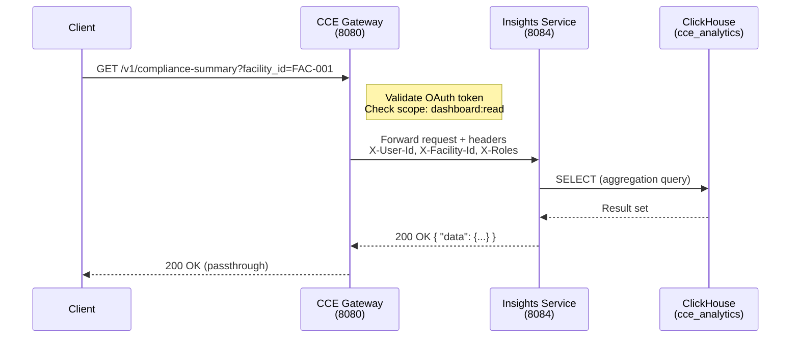
```mermaid
sequenceDiagram
    participant Client
    participant Gateway as CCE Gateway<br/>(8080)
    participant Insights as Insights Service<br/>(8084)
    participant DB as ClickHouse<br/>(cce_analytics)

    Client->>Gateway: GET /v1/compliance-summary?facility_id=FAC-001
    Note right of Gateway: Validate OAuth token<br/>Check scope: dashboard:read

    Gateway->>Insights: Forward request + headers<br/>X-User-Id, X-Facility-Id, X-Roles

    Insights->>DB: SELECT (aggregation query)
    DB-->>Insights: Result set

    Insights-->>Gateway: 200 OK { "data": {...} }
    Gateway-->>Client: 200 OK (passthrough)
```

## 2. Compliance Summary Aggregation Flow

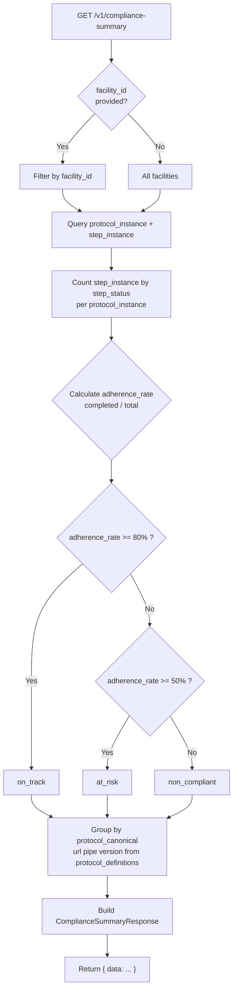
```mermaid
flowchart TD
    A[GET /v1/compliance-summary] --> B{facility_id<br/>provided?}
    B -- Yes --> C[Filter by facility_id]
    B -- No --> D[All facilities]
    C --> E[Query protocol_instance + step_instance]
    D --> E

    E --> F[Count step_instance by step_status<br/>per protocol_instance]
    F --> G{Calculate adherence_rate<br/>completed / total}
    G --> H{"adherence_rate >= 80% ?"}
    H -- Yes --> I[on_track]
    H -- No --> J{"adherence_rate >= 50% ?"}
    J -- Yes --> K[at_risk]
    J -- No --> L[non_compliant]

    I --> M[Group by protocol_canonical<br/>url pipe version from protocol_definitions]
    K --> M
    L --> M
    M --> N[Build ComplianceSummaryResponse]
    N --> O["Return { data: ... }"]
```

## 3. Patient Timeline Query Flow

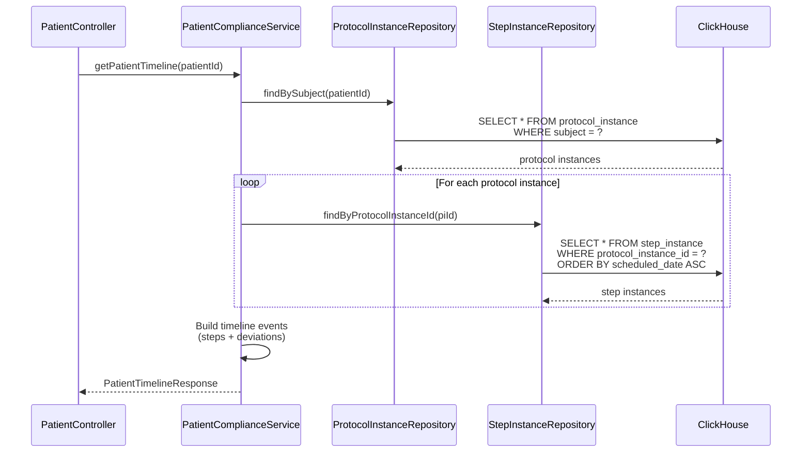
```mermaid
sequenceDiagram
    participant Controller as PatientController
    participant Service as PatientComplianceService
    participant PIRepo as ProtocolInstanceRepository
    participant SIRepo as StepInstanceRepository
    participant DB as ClickHouse

    Controller->>Service: getPatientTimeline(patientId)
    Service->>PIRepo: findBySubject(patientId)
    PIRepo->>DB: SELECT * FROM protocol_instance<br/>WHERE subject = ?
    DB-->>PIRepo: protocol instances

    loop For each protocol instance
        Service->>SIRepo: findByProtocolInstanceId(piId)
        SIRepo->>DB: SELECT * FROM step_instance<br/>WHERE protocol_instance_id = ?<br/>ORDER BY scheduled_date ASC
        DB-->>SIRepo: step instances
    end

    Service->>Service: Build timeline events<br/>(steps + deviations)
    Service-->>Controller: PatientTimelineResponse
```

## 4. Deviation Trend Analysis Flow

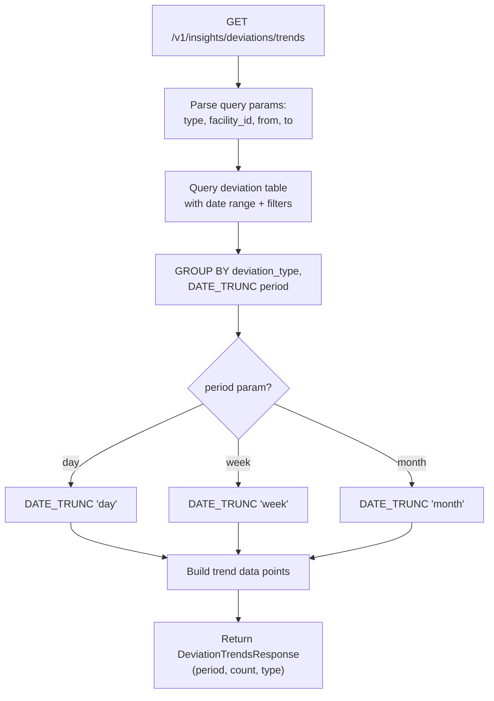
```mermaid
flowchart TD
    A[GET /v1/insights/deviations/trends] --> B[Parse query params:<br/>type, facility_id, from, to]
    B --> C[Query deviation table<br/>with date range + filters]
    C --> D[GROUP BY deviation_type,<br/>DATE_TRUNC period]

    D --> E{period param?}
    E -- day --> F[DATE_TRUNC 'day']
    E -- week --> G[DATE_TRUNC 'week']
    E -- month --> H[DATE_TRUNC 'month']

    F --> I[Build trend data points]
    G --> I
    H --> I

    I --> J["Return DeviationTrendsResponse<br/>(period, count, type)"]
```

## 5. Facility Compliance Overview Flow

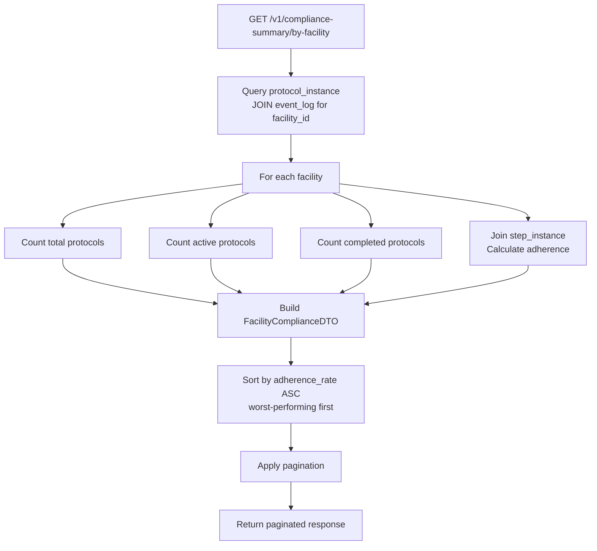
```mermaid
flowchart TD
    A[GET /v1/compliance-summary/by-facility] --> B[Query protocol_instance<br/>JOIN event_log for facility_id]
    B --> C[For each facility]
    C --> D[Count total protocols]
    C --> E[Count active protocols]
    C --> F[Count completed protocols]
    C --> G[Join step_instance<br/>Calculate adherence]

    D --> H[Build FacilityComplianceDTO]
    E --> H
    F --> H
    G --> H

    H --> I[Sort by adherence_rate ASC<br/>worst-performing first]
    I --> J[Apply pagination]
    J --> K[Return paginated response]
```

## 6. Export Flow

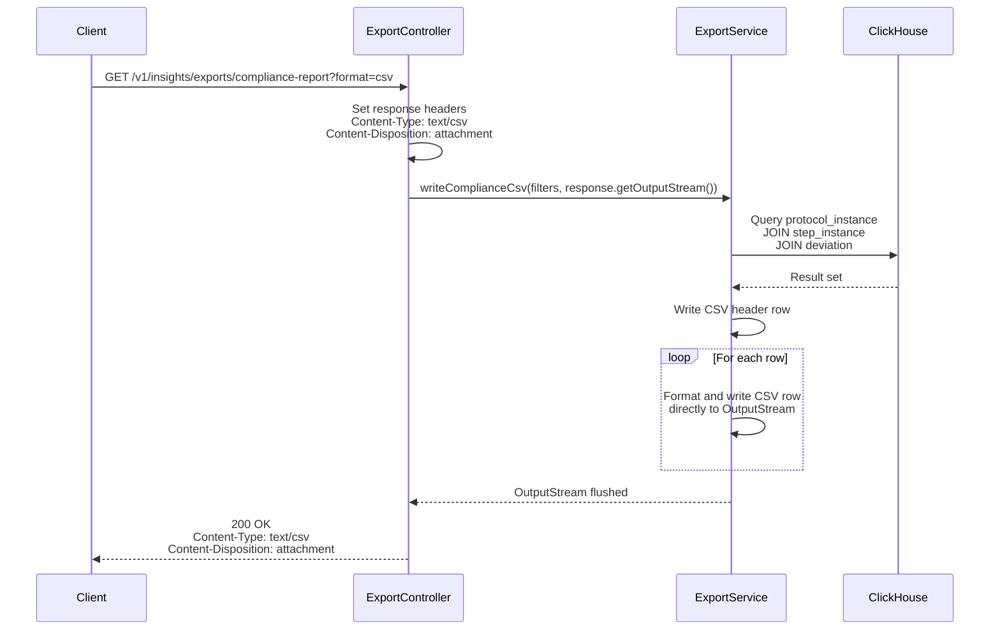
```mermaid
sequenceDiagram
    participant Client
    participant Controller as ExportController
    participant Service as ExportService
    participant DB as ClickHouse

    Client->>Controller: GET /v1/insights/exports/compliance-report?format=csv
    Controller->>Controller: Set response headers<br/>Content-Type: text/csv<br/>Content-Disposition: attachment

    Controller->>Service: writeComplianceCsv(filters, response.getOutputStream())

    Service->>DB: Query protocol_instance<br/>JOIN step_instance<br/>JOIN deviation
    DB-->>Service: Result set

    Service->>Service: Write CSV header row
    loop For each row
        Service->>Service: Format and write CSV row<br/>directly to OutputStream
    end

    Service-->>Controller: OutputStream flushed
    Controller-->>Client: 200 OK<br/>Content-Type: text/csv<br/>Content-Disposition: attachment
```

## 7. Event Volume Analytics Flow

### 7.1 Event Volume by Resource Type / Facility

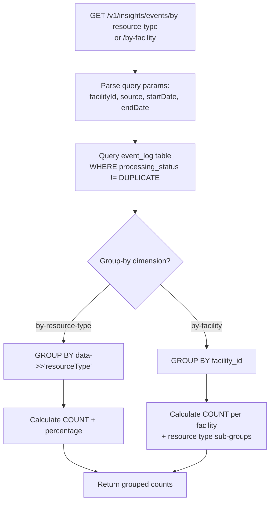
```mermaid
flowchart TD
    A[GET /v1/insights/events/by-resource-type<br/>or /by-facility] --> B[Parse query params:<br/>facilityId, source, startDate, endDate]
    B --> C[Query event_log table<br/>WHERE processing_status != DUPLICATE]

    C --> D{Group-by dimension?}
    D -- by-resource-type --> E["GROUP BY data->>'resourceType'"]
    D -- by-facility --> F[GROUP BY facility_id]

    E --> G[Calculate COUNT + percentage]
    F --> H[Calculate COUNT per facility<br/>+ resource type sub-groups]

    G --> I[Return grouped counts]
    H --> I
```

### 7.2 Event Volume Trends

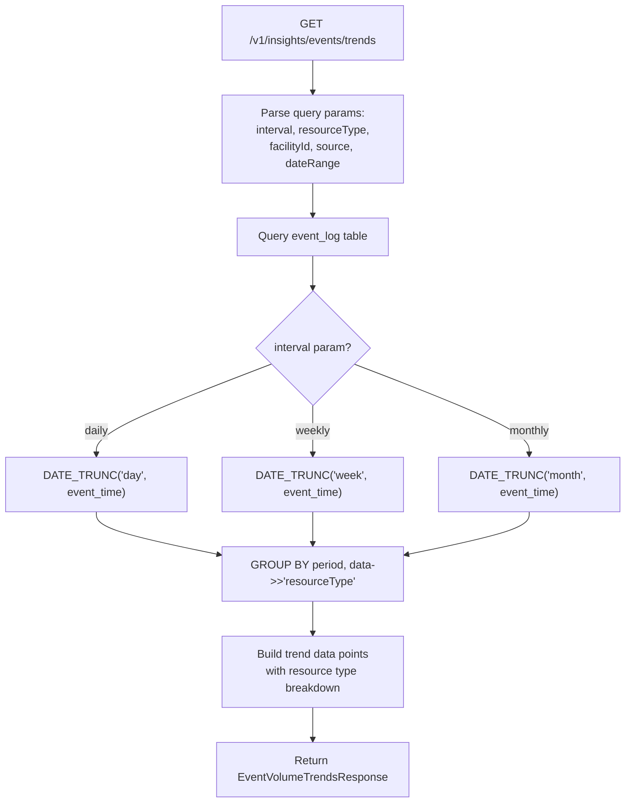
```mermaid
flowchart TD
    A[GET /v1/insights/events/trends] --> B[Parse query params:<br/>interval, resourceType,<br/>facilityId, source, dateRange]
    B --> C[Query event_log table]
    C --> D{interval param?}
    D -- daily --> E["DATE_TRUNC('day', event_time)"]
    D -- weekly --> F["DATE_TRUNC('week', event_time)"]
    D -- monthly --> G["DATE_TRUNC('month', event_time)"]

    E --> H["GROUP BY period, data->>'resourceType'"]
    F --> H
    G --> H

    H --> I[Build trend data points<br/>with resource type breakdown]
    I --> J[Return EventVolumeTrendsResponse]
```

### 7.3 Event Volume Summary (Composite)

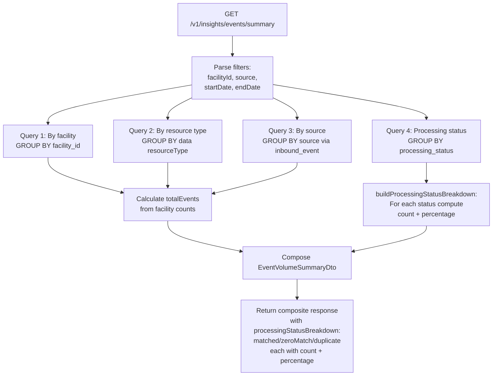
```mermaid
flowchart TD
    A[GET /v1/insights/events/summary] --> B[Parse filters:<br/>facilityId, source,<br/>startDate, endDate]

    B --> C[Query 1: By facility<br/>GROUP BY facility_id]
    B --> D[Query 2: By resource type<br/>GROUP BY data resourceType]
    B --> E[Query 3: By source<br/>GROUP BY source via inbound_event]
    B --> F[Query 4: Processing status<br/>GROUP BY processing_status]

    C --> G[Calculate totalEvents<br/>from facility counts]
    D --> G
    E --> G

    F --> H[buildProcessingStatusBreakdown:<br/>For each status compute<br/>count + percentage]

    G --> I[Compose EventVolumeSummaryDto]
    H --> I

    I --> J[Return composite response<br/>with processingStatusBreakdown:<br/>matched/zeroMatch/duplicate<br/>each with count + percentage]
```

## 8. Protocol Analytics Flow

### 8.1 Step Analytics

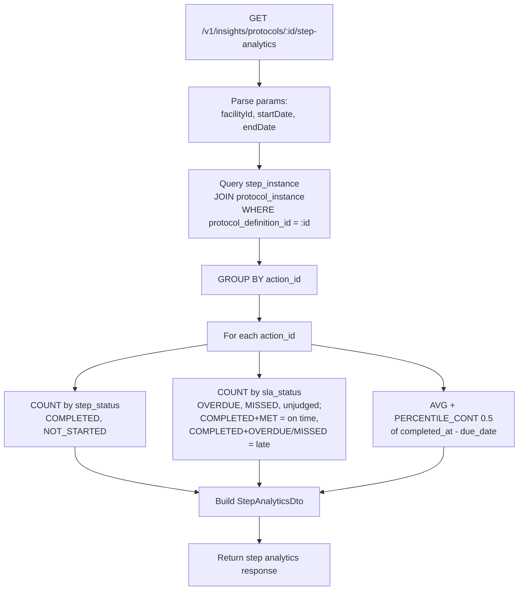
```mermaid
flowchart TD
    A[GET /v1/insights/protocols/:id/step-analytics] --> B[Parse params:<br/>facilityId, startDate, endDate]
    B --> C[Query step_instance<br/>JOIN protocol_instance<br/>WHERE protocol_definition_id = :id]
    C --> D[GROUP BY action_id]
    D --> E[For each action_id]

    E --> F[COUNT by step_status<br/>COMPLETED, NOT_STARTED]
    E --> G[COUNT by sla_status<br/>OVERDUE, MISSED, unjudged;<br/>COMPLETED+MET = on time,<br/>COMPLETED+OVERDUE/MISSED = late]
    E --> H[AVG + PERCENTILE_CONT 0.5<br/>of completed_at - due_date]

    F --> I[Build StepAnalyticsDto]
    G --> I
    H --> I

    I --> J[Return step analytics response]
```

### 8.2 Completion Funnel

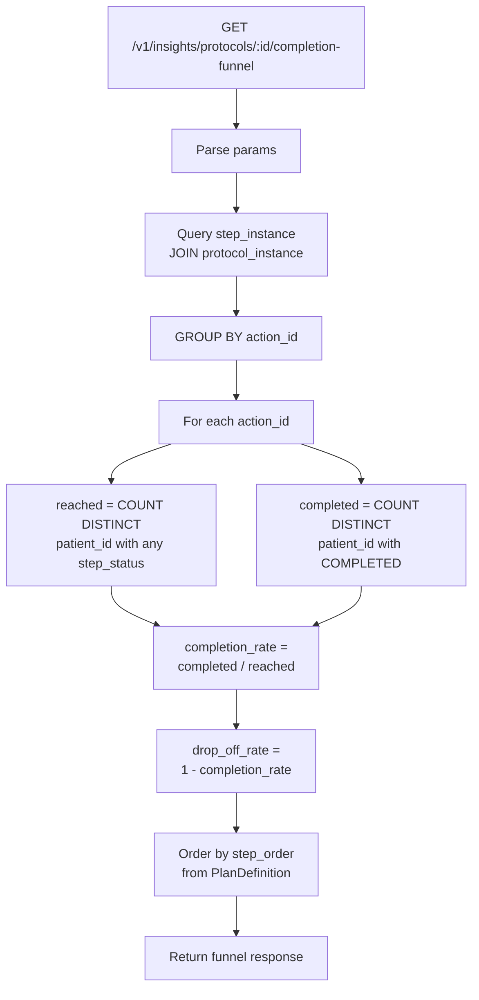
```mermaid
flowchart TD
    A[GET /v1/insights/protocols/:id/completion-funnel] --> B[Parse params]
    B --> C[Query step_instance<br/>JOIN protocol_instance]
    C --> D[GROUP BY action_id]
    D --> E[For each action_id]

    E --> F[reached = COUNT DISTINCT<br/>patient_id with any step_status]
    E --> G[completed = COUNT DISTINCT<br/>patient_id with COMPLETED]

    F --> H["completion_rate =<br/>completed / reached"]
    G --> H
    H --> I["drop_off_rate =<br/>1 - completion_rate"]

    I --> J[Order by step_order<br/>from PlanDefinition]
    J --> K[Return funnel response]
```

### 8.3 Outcome Distribution

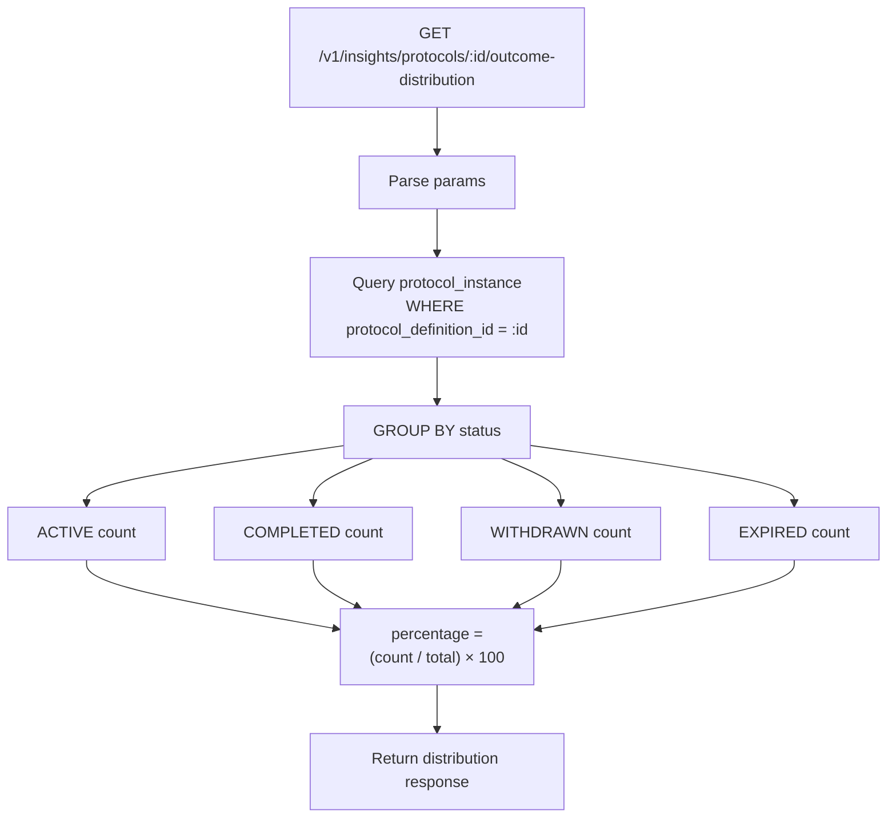
```mermaid
flowchart TD
    A[GET /v1/insights/protocols/:id/outcome-distribution] --> B[Parse params]
    B --> C[Query protocol_instance<br/>WHERE protocol_definition_id = :id]
    C --> D[GROUP BY status]

    D --> E[ACTIVE count]
    D --> F[COMPLETED count]
    D --> G[WITHDRAWN count]
    D --> H[EXPIRED count]

    E --> I["percentage =<br/>(count / total) × 100"]
    F --> I
    G --> I
    H --> I

    I --> J[Return distribution response]
```

### 8.4 Enrollment Trends

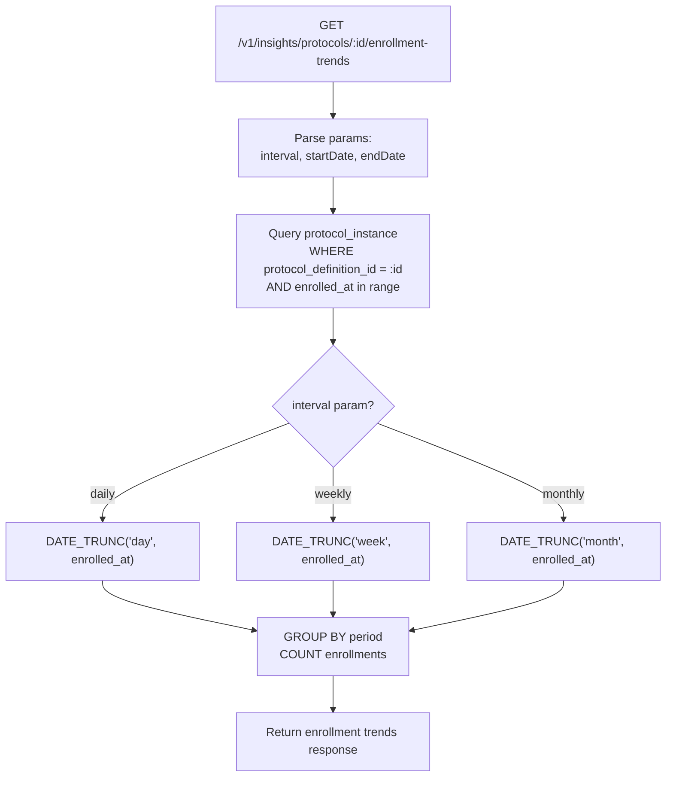
```mermaid
flowchart TD
    A[GET /v1/insights/protocols/:id/enrollment-trends] --> B[Parse params:<br/>interval, startDate, endDate]
    B --> C[Query protocol_instance<br/>WHERE protocol_definition_id = :id<br/>AND enrolled_at in range]

    C --> D{interval param?}
    D -- daily --> E["DATE_TRUNC('day', enrolled_at)"]
    D -- weekly --> F["DATE_TRUNC('week', enrolled_at)"]
    D -- monthly --> G["DATE_TRUNC('month', enrolled_at)"]

    E --> H[GROUP BY period<br/>COUNT enrollments]
    F --> H
    G --> H

    H --> I[Return enrollment trends response]
```

## 9. Facility Ranking Flow

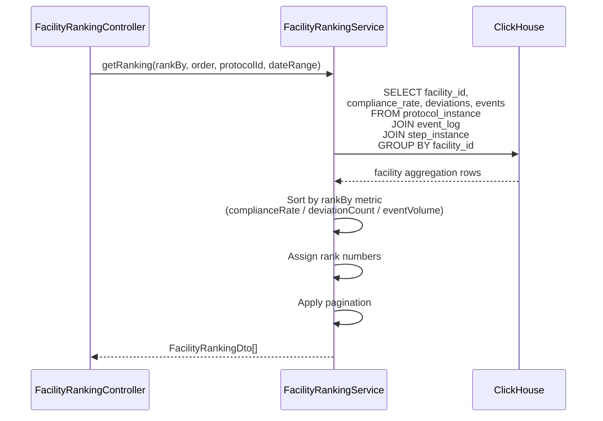
```mermaid
sequenceDiagram
    participant Controller as FacilityRankingController
    participant Service as FacilityRankingService
    participant DB as ClickHouse

    Controller->>Service: getRanking(rankBy, order, protocolId, dateRange)

    Service->>DB: SELECT facility_id,<br/>compliance_rate, deviations, events<br/>FROM protocol_instance<br/>JOIN event_log<br/>JOIN step_instance<br/>GROUP BY facility_id

    DB-->>Service: facility aggregation rows

    Service->>Service: Sort by rankBy metric<br/>(complianceRate / deviationCount / eventVolume)
    Service->>Service: Assign rank numbers
    Service->>Service: Apply pagination

    Service-->>Controller: FacilityRankingDto[]
```

## 10. Deviation Analytics Flow

### 10.1 Deviations by Action

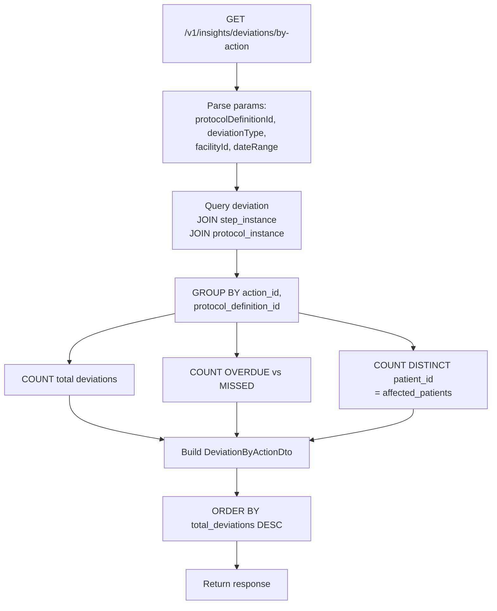
```mermaid
flowchart TD
    A[GET /v1/insights/deviations/by-action] --> B[Parse params:<br/>protocolDefinitionId, deviationType,<br/>facilityId, dateRange]
    B --> C[Query deviation<br/>JOIN step_instance<br/>JOIN protocol_instance]
    C --> D[GROUP BY action_id,<br/>protocol_definition_id]

    D --> E[COUNT total deviations]
    D --> F[COUNT OVERDUE vs MISSED]
    D --> G[COUNT DISTINCT patient_id<br/>= affected_patients]

    E --> H[Build DeviationByActionDto]
    F --> H
    G --> H

    H --> I[ORDER BY total_deviations DESC]
    I --> J[Return response]
```

### 10.2 Deviation Resolution Rate

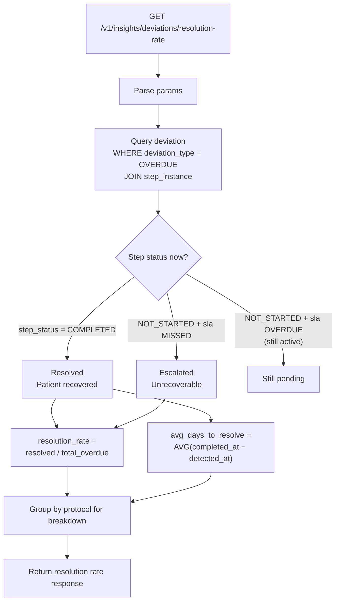
```mermaid
flowchart TD
    A[GET /v1/insights/deviations/resolution-rate] --> B[Parse params]
    B --> C[Query deviation<br/>WHERE deviation_type = OVERDUE<br/>JOIN step_instance]
    C --> D{Step status now?}

    D -- "step_status = COMPLETED" --> E[Resolved<br/>Patient recovered]
    D -- "NOT_STARTED + sla MISSED" --> F[Escalated<br/>Unrecoverable]
    D -- "NOT_STARTED + sla OVERDUE<br/>(still active)" --> G[Still pending]

    E --> H["resolution_rate =<br/>resolved / total_overdue"]
    F --> H
    E --> I["avg_days_to_resolve =<br/>AVG(completed_at − detected_at)"]

    H --> J[Group by protocol for breakdown]
    I --> J
    J --> K[Return resolution rate response]
```

## 11. Patient Risk Analytics Flow

### 11.1 At-Risk Hotspots

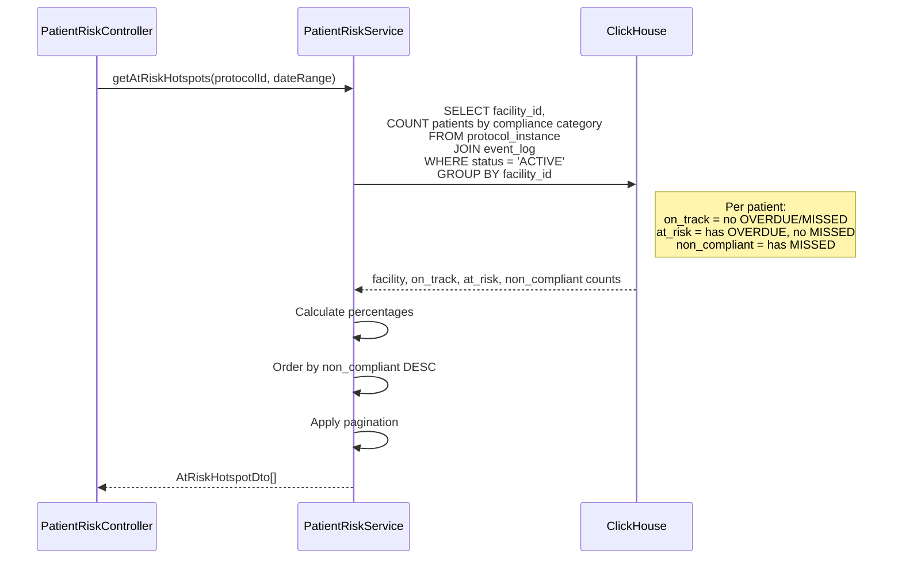
```mermaid
sequenceDiagram
    participant Controller as PatientRiskController
    participant Service as PatientRiskService
    participant DB as ClickHouse

    Controller->>Service: getAtRiskHotspots(protocolId, dateRange)

    Service->>DB: SELECT facility_id,<br/>COUNT patients by compliance category<br/>FROM protocol_instance<br/>JOIN event_log<br/>WHERE status = 'ACTIVE'<br/>GROUP BY facility_id

    Note right of DB: Per patient:<br/>on_track = no OVERDUE/MISSED<br/>at_risk = has OVERDUE, no MISSED<br/>non_compliant = has MISSED

    DB-->>Service: facility, on_track, at_risk, non_compliant counts

    Service->>Service: Calculate percentages
    Service->>Service: Order by non_compliant DESC
    Service->>Service: Apply pagination

    Service-->>Controller: AtRiskHotspotDto[]
```

### 11.2 Repeat Deviations

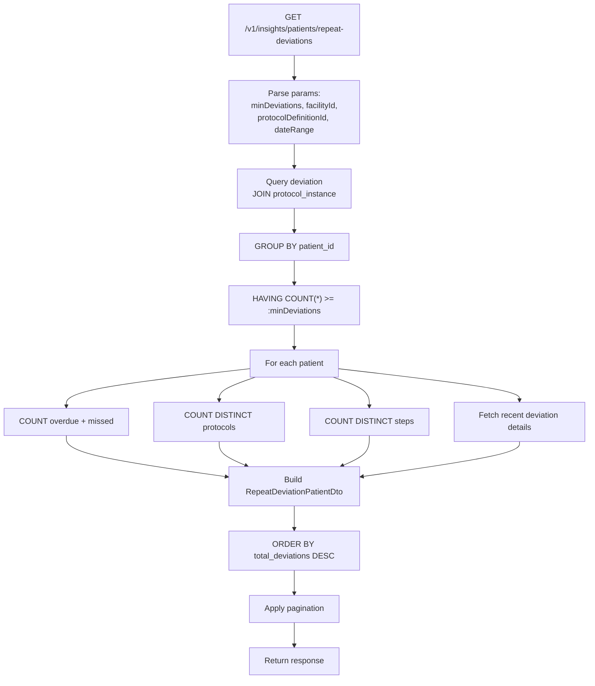
```mermaid
flowchart TD
    A[GET /v1/insights/patients/repeat-deviations] --> B[Parse params:<br/>minDeviations, facilityId,<br/>protocolDefinitionId, dateRange]
    B --> C[Query deviation<br/>JOIN protocol_instance]
    C --> D[GROUP BY patient_id]
    D --> E["HAVING COUNT(*) >= :minDeviations"]

    E --> F[For each patient]
    F --> G[COUNT overdue + missed]
    F --> H[COUNT DISTINCT protocols]
    F --> I[COUNT DISTINCT steps]
    F --> J[Fetch recent deviation details]

    G --> K[Build RepeatDeviationPatientDto]
    H --> K
    I --> K
    J --> K

    K --> L[ORDER BY total_deviations DESC]
    L --> M[Apply pagination]
    M --> N[Return response]
```

## 12. Patient Events & Deviations Flow

### 13.1 Patient Events

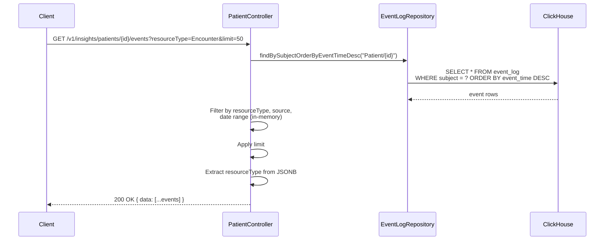
```mermaid
sequenceDiagram
    participant Client
    participant Controller as PatientController
    participant Repo as EventLogRepository
    participant DB as ClickHouse

    Client->>Controller: GET /v1/insights/patients/{id}/events?resourceType=Encounter&limit=50
    Controller->>Repo: findBySubjectOrderByEventTimeDesc("Patient/{id}")
    Repo->>DB: SELECT * FROM event_log<br/>WHERE subject = ? ORDER BY event_time DESC
    DB-->>Repo: event rows

    Controller->>Controller: Filter by resourceType, source,<br/>date range (in-memory)
    Controller->>Controller: Apply limit
    Controller->>Controller: Extract resourceType from JSONB

    Controller-->>Client: 200 OK { data: [...events] }
```

### 13.2 Patient Deviations

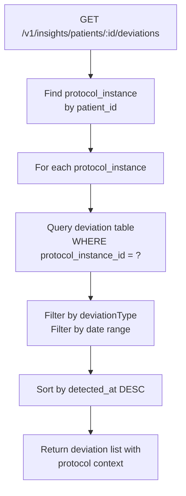
```mermaid
flowchart TD
    A[GET /v1/insights/patients/:id/deviations] --> B[Find protocol_instance<br/>by patient_id]
    B --> C[For each protocol_instance]
    C --> D[Query deviation table<br/>WHERE protocol_instance_id = ?]
    D --> E[Filter by deviationType<br/>Filter by date range]
    E --> F[Sort by detected_at DESC]
    F --> G[Return deviation list with<br/>protocol context]
```

## 14. Ingestion Analytics Flow

### 14.1 Ingestion Funnel

```mermaid
flowchart TD
    A[GET /v1/insights/ingestion/funnel] --> B[Parse params:<br/>facilityId, source, interval, dateRange]
    B --> C[Query inbound_event<br/>GROUP BY status]

    C --> D[ACCEPTED count]
    C --> E[REJECTED count]
    C --> F[DUPLICATE count]

    D --> G[Calculate acceptance rate]
    E --> G
    F --> G

    G --> H{interval provided?}
    H -- Yes --> I[Query trend data<br/>DATE_TRUNC by interval<br/>GROUP BY period, status]
    H -- No --> J[Skip trends]

    I --> K[Build IngestionFunnelDto<br/>with status breakdown + trends]
    J --> K
    K --> L[Return response]
```

### 14.2 Rejection Analytics

```mermaid
flowchart TD
    A[GET /v1/insights/ingestion/rejections] --> B[Parse params:<br/>facilityId, source, dateRange]
    B --> C[Query inbound_event<br/>WHERE status = REJECTED<br/>GROUP BY rejection_reason]
    C --> D[Calculate reason percentages]

    B --> E[Query inbound_event<br/>GROUP BY source, status]
    B --> F[Query inbound_event<br/>WHERE status = REJECTED<br/>GROUP BY source, rejection_reason]

    E --> G[Build per-source<br/>rejection rates]
    F --> G
    D --> H[Build RejectionAnalyticsDto]
    G --> H
    H --> I[Return response]
```

### 14.3 Source Data Quality

```mermaid
flowchart TD
    A[GET /v1/insights/ingestion/source-quality] --> B[Parse params:<br/>facilityId, dateRange]
    B --> C[Query inbound_event<br/>GROUP BY source, status]

    C --> D[For each source]
    D --> E[Calculate acceptance rate<br/>= ACCEPTED / total]
    D --> F[Calculate rejection rate<br/>= REJECTED / total]
    D --> G[Calculate duplicate rate<br/>= DUPLICATE / total]

    E --> H["Quality score =<br/>(acceptance rate × 100)"]
    F --> H
    G --> H

    H --> I[Build SourceDataQualityDto]
    I --> J[Return response]
```

### 14.4 Pipeline Loss

```mermaid
sequenceDiagram
    participant Controller as IngestionAnalyticsController
    participant Service as IngestionAnalyticsService
    participant InboundRepo as InboundEventRepository
    participant EventRepo as EventLogRepository
    participant DB as ClickHouse

    Controller->>Service: getPipelineLoss(facilityId, dateRange)

    Service->>InboundRepo: countAcceptedBySource()
    InboundRepo->>DB: SELECT source, COUNT(*)<br/>FROM inbound_event WHERE status = 'ACCEPTED'
    DB-->>InboundRepo: accepted counts

    Service->>EventRepo: countMatchedBySource()
    EventRepo->>DB: SELECT source, COUNT(*)<br/>FROM event_log WHERE processing_status = 'MATCHED'
    DB-->>EventRepo: matched counts

    Service->>Service: For each source:<br/>loss = accepted − matched<br/>loss_rate = loss / accepted

    Service-->>Controller: PipelineLossDto
    Controller-->>Controller: Wrap in ApiResponse
```

## 15. Lookup Endpoints Flow

```mermaid
flowchart TD
    A[GET /v1/insights/lookups/*] --> B{Which lookup?}

    B -- /protocols --> C[ProtocolDefinitionRepository.findAll]
    B -- /facilities --> D[EventLogRepository.findDistinctFacilityIds]
    B -- /practitioners --> E[EventLogRepository.findDistinctPractitioners]
    B -- /sources --> F[InboundEventRepository.findDistinctSources]
    B -- /patients --> G[ProtocolInstanceRepository.findDistinctPatientIds]

    C --> H["@Cacheable(lookups, key=protocols)"]
    D --> H
    E --> H
    F --> H
    G --> H

    H --> I{Cache hit?}
    I -- Yes --> J[Return cached data]
    I -- No --> K[Execute DB query]
    K --> L[Store in lookups cache<br/>TTL: 60 min]
    L --> J
```

## 16. Caching Flow (3-Tier Caffeine)

```mermaid
flowchart TD
    A[Incoming Request] --> B[Controller]
    B --> C[Service Method<br/>with @Cacheable]

    C --> D{Cache Lookup}
    D -- Hit --> E[Return cached response]
    D -- Miss --> F[Execute DB query]

    F --> G{Which cache tier?}
    G -- "lookups<br/>(60 min TTL, 50 max)" --> H[Store in lookups cache]
    G -- "analytics<br/>(30 min TTL, 200 max)" --> I[Store in analytics cache]
    G -- "metrics<br/>(15 min TTL, 500 max)" --> J[Store in metrics cache]

    H --> E
    I --> E
    J --> E

    subgraph "Cache Tiers"
        K["lookups: protocols, facilities,<br/>practitioners, sources, patients"]
        L["analytics: compliance summaries,<br/>protocol analytics, deviations,<br/>patient risk, facility ranking"]
        M["metrics: event volume,<br/>ingestion pipeline,<br/>processing quality"]
    end
```

## 17. Protocol Action Order Flow

```mermaid
sequenceDiagram
    participant Controller as ProtocolAnalyticsController
    participant Service as ProtocolAnalyticsService
    participant Repo as ProtocolDefinitionRepository
    participant DB as ClickHouse

    Controller->>Service: getActionOrder(protocolDefinitionId)
    Service->>Repo: findById(protocolDefinitionId)
    Repo->>DB: SELECT * FROM protocol_definition WHERE id = ?
    DB-->>Repo: protocol definition row

    Service->>Service: Parse definition JSONB<br/>Extract action[] array

    Service->>Service: collectActionEntriesRecursive(actions)
    Note right of Service: For each action:<br/>- Extract actionId (action.id)<br/>- Extract type (action.type.coding[0].code)<br/>- Extract title (action.title)<br/>- Extract requiredBehavior<br/>- Recurse into sub-actions

    Service-->>Controller: List<ActionOrderEntryDto>
    Controller-->>Controller: Wrap in ApiResponse
```

## 18. Intelligence Delivery Summary Flow

```mermaid
flowchart TD
    A[GET /v1/insights/intelligence/summary] --> B[Parse params:<br/>startDate, endDate]
    B --> C[Query intelligence_delivery table]
    C --> D[COUNT total deliveries]
    C --> E[COUNT by action_type]
    C --> F[COUNT by status<br/>SUCCESS/FAILED/PENDING]

    D --> G[Query deviation table<br/>for deviation counts]
    E --> G
    F --> G

    G --> H[Build IntelligenceSummaryDto]
    H --> I[Return response]
```

## 19. Dashboard Overview Flow

```mermaid
flowchart TD
    A[GET /v1/insights/dashboard/overview] --> B[Parse params:<br/>facilityId, startDate, endDate]

    B --> C[Query protocol_instance<br/>COUNT total patients]
    B --> D[Query protocol_instance<br/>COUNT total enrollments]
    B --> E[Query step_instance<br/>Calculate compliance rate]
    B --> F[Query deviation<br/>COUNT active deviations]

    C --> G[Build DashboardOverviewDto]
    D --> G
    E --> G
    F --> G
    G --> H[Return response]
```
